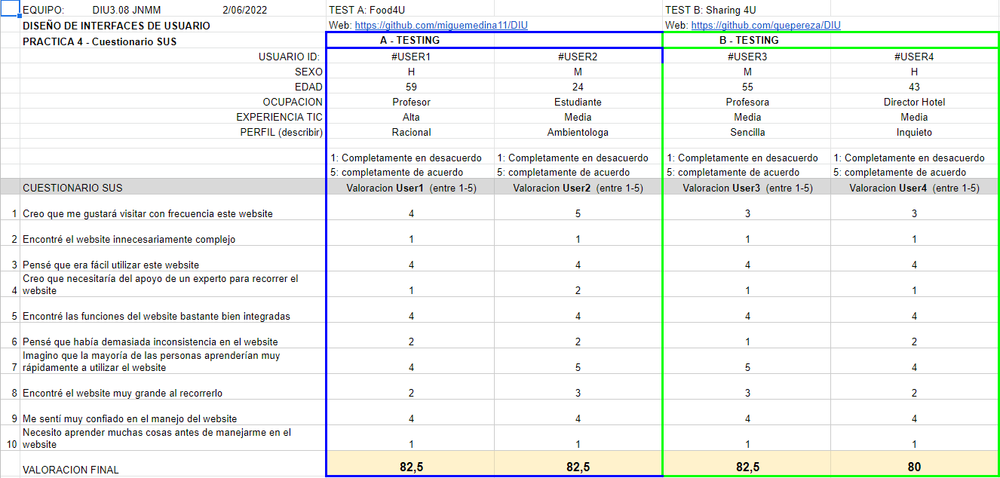

# DIU22
Prácticas Diseño Interfaces de Usuario 2021-22 (Tema: Hostels) 

Grupo: DIU3_08JavierNuñezMiguelMedina.  Curso: 2021/22 
Updated: 11/2/2022

Proyecto: 
>>> Hostel 4U

Descripción: 

>>> Crear un microsite para facilitar el acceso a toda la información del restaurante. Proporcionando el menú y ofertas exclusivas para la gente del hostal. También debería permitir la reserva.

Logotipo: 
>>> 

Miembros
 * :bust_in_silhouette:   Javier Nuñez Suarez     :octocat: @Javinunezs
 * :bust_in_silhouette:  Miguel Medina Martínez     :octocat: @miguemedina11

----- 

# Proceso de Diseño 

## Paso 1. UX Desk Research & Analisis 

 1.a Competitive Analysis
-----

Nuestro hostel se centra mas en ofrecer servicios de hotel como restaurante y bar de copas con actuaciones. Aun así ofrece lavanderia, wifi gratis y excursiones. Lo que lo hace un buen hostel a pesar de contar con taquillas de pago y no ofrecer recepción las 24 horas del dia.

 1.b Persona
-----

Hemos elegido dos personas que a pesar de ser ambas solteras, buscan una experiencia completamente diferente en nuestro hostel. Uno salir de fiesta y la otra una visita cultural. Aun así sus motivaciones tienen en comun el aspecto social que ofrecen los hostels.

 1.c User Journey Map
----

Estás dos experiencias de usuario las hemos elegido en base al carácter de cada persona, adaptándose por ejemplo la estancia y la manera de acceder a la información según cada persona.

 1.d Usability Review
----
>>>  Revisión de usabilidad:
>>> - Enlace al documento:  [Usability Review](P1/Usability-review-template.xlsx)
>>> - Valoración final (numérica): 83
>>> - Comentario sobre la valoración: En general la pagina cumple bien con los objetivos y permite reservar y saber mas del establecimiento. Aun asi cuenta con algunos errores en cuanto al uso de colores de la tipografia. Tampoco permite distinguir donde te encuentras en la pagina. Cabe destacar que el proceso de reserva es muy intuitivo e incluso te corrige algunos errores mientras que rellenas los campos. 

## Paso 2. UX Design  

 2.a Feedback Capture Grid / EMpathy map / POV
----

 2.b ScopeCanvas

----
Propuesta de valor:
Crear un microsite para facilitar el acceso a toda la información del restaurante. Proporcionando el menú y ofertas exclusivas para la gente del hostal. También debería permitir la reserva.

 2.b Tasks analysis 
-----

 2.c IA: Sitemap + Labelling 
----

> Restaurante: Descubre lo que ofrece nuestro restaurante y reserva de forma sencilla.

> Menú: Información detallada de los platos y precios que ofrece nuestro restaurante además de fotos de algunos de éstos.

> Ofertas: Información detallada y precios de las ofertas disponibles para los clientes del hostel. 

> Contacto: Formulario a rellenar para contactar por email. Información de la localización y del contacto telefónico.

 2.d Wireframes
-----

## Paso 3. Mi UX-Case Study (diseño)

 3.a Moodboard
-----

  3.b Landing Page
----

 3.c Guidelines
----

Tras consultar la página web https://ui-patterns.com/ hemos recolectado unos patrones que nos pueden ser útiles en el desarrollo de nuestra página:

- [Home link](https://ui-patterns.com/patterns/HomeLink): Para facilitar la vuelta a la página principal presionando el logo

- [Navigation tabs](https://ui-patterns.com/patterns/NavigationTabs): Para llevar a cabo la navegación entre nuestro sitio con varias páginas.

- [Carousel](https://ui-patterns.com/patterns/Carousel): Para mostrar imágenes relevantes

- [Input prompt](https://ui-patterns.com/patterns/InputPrompt): Para pedir información relevante al usuario para contactar con nosotros o hacer su reserva

- [Testimonials](https://ui-patterns.com/patterns/testimonials): Para que los usuarios puedan ver las reseñas que otros usuarios han dejado sobre nuestro establecimiento.

  3.d Mockup
----

 A partir de los bocetos realizados previamente, hemos desarrollado un prototipo usando Protopie que puede ser accedido a través de este link:

https://cloud.protopie.io/p/dceb60d53b

 3.e ¿My UX-Case Study?
-----

**Inspiración**
Food4u surge a raíz de querer ofrecer, tanto a los usuarios que se alojan en Hostel4u como a usuarios externos, nuevas sensaciones y esencias que podrán captar gracias a este nuevo restaurante, agregando un valor extra a una visita por granada. Al poder acceder usuarios externos a este Hostel y a la web del restaurante, se realizará una publicidad indirecta del Hostel.
Al inicio nos encontramos con las experiencias de Greta Y Petrov, gente joven con ganas de realizar actividades y pasar tiempo en las calles de Granada, lo que les hacía querer buscar buenos restaurantes y donde poder  descansar.

**Inicio del proyecto**
Estas dos personas, Greta y Petrov junto a nosotros mismos hemos generado diferentes ideas que junto a la malla receptora y el scope canvas ayudaran a poder desarrollar más tarde un diseño propio
Por ello lo primero que hicimos fue crear unos bocetos a mano alzada con lo que serían nuestras primeras ideas de cara a la idea de la extensión web para el restaurante.

**Diseño**
Ya con las ideas más claras y con la estructura y funcionalidades de la web pensada, comenzamos a dotar de personalidad  al proyecto mediante un moodboard que recogiese todo lo que queríamos reflejar en nuestro proyecto, dotando a nuestra web de una identidad muy similar a la de Hostel4u. Este moodboard se conforma de imágenes, tipografías o fuentes entre otros elementos...
Tras esto el siguiente paso fue diseñar un landing page con el que poder llamar la atención a clientes potenciales, haciendo de esta página un sitio sencillo y fácil de leer, dándolo mucha importancia al componente visual.
Por último y antes de darle la apariencia final con protopie a la aplicación, lo que hicimos fue analizar patrones de diseño que se ajustaran a las necesidades de los usuarios.

**Conclusión**
Tras crear usuarios persona, dos en concretos, y tras usarnos a nosotros mismo también como inspiración, hemos sido capaces de desarrollar un prototipo fiel de lo que sería nuestra webApp basada en un restaurante para Hostel4U. 
Gracias a esta actividad hemos aprendido a cómo crear un diseño y un estilo que refleje la identidad de lo que nosotros hemos ido creando, en concreto usando técnicas de branding y diseño.
Hemos conseguido poder crear una webApp adaptada a los usuarios y que cubre sus necesidades básicas.

## Paso 4. Evaluación 

 4.a Caso asignado
----
Sharing4U es una aplicación diseñada para compartir experiencias con otros usuarios y estar al tanto de los próximos eventos. Las experiencias engloban tanto eventos de ocio, como turísticos o simplemente alguna vivencia que haya sido agradable y que se quiera compartir con el resto de usuarios.

https://github.com/quepereza/DIU

 4.b User Testing
----

>>> Seleccione 4 personas ficticias. Exprese las ideas de posibles situaciones conflictivas de esa persona en las propuestas evaluadas. Asigne dos a Caso A y 2 al caso B
 

| Usuarios | Sexo/Edad     | Ocupación   |  Exp.TIC    | Personalidad | Plataforma | TestA/B
| ------------- | -------- | ----------- | ----------- | -----------  | ---------- | ----
| User1  | H / 59   | Profesor  | Alta       | Racional | Web       | A 
| User2  | M / 24   | Estudiante  | Media       | Ambientologa       | Web        | A 
| User3  | M / 55   | Profesora     | Baja        | Sencilla    | Móvil      | B 
| User4  | H / 43   | Director Hotel  | Media       | Inquieto     | Móvil        | B 

. 4.c Cuestionario SUS
----

Nos esperabamos consiguir una puntuacion parecida a nuestros compañeros y ademas estimabamos que los dos ibamos a llegar al rango de aceptable.

 4.d Usability Report
----

En general es un sitio web muy intuitivo y completo. La interfaz es consistente y cumple las expectativas de los usuarios. 
La página principal no presenta con claridad lo que el sitio ofrece, dispone de un desplegable a la derecha que no es intuitivo, debería ir hacia abajo. No llama en exceso la atención (Uso de colores apagados, se le da más prioridad al texto que las imágenes). 
Por último el menú desplegable no encaja con la interfaz y podría ocupar toda la verticalidad de la pantalla y los iconos son redundantes y confunden. 
El header ocupa un gran espacio de pantalla. Además el footer de la página principal no es claro y tiene una distribución que no concuerda con el resto de la aplicación móvil.

## Conclusión final / Valoración de las prácticas

>>> (90-150 palabras) Opinión del proceso de desarrollo de diseño siguiendo metodología UX y valoración (positiva /negativa) de los resultados obtenidos  

