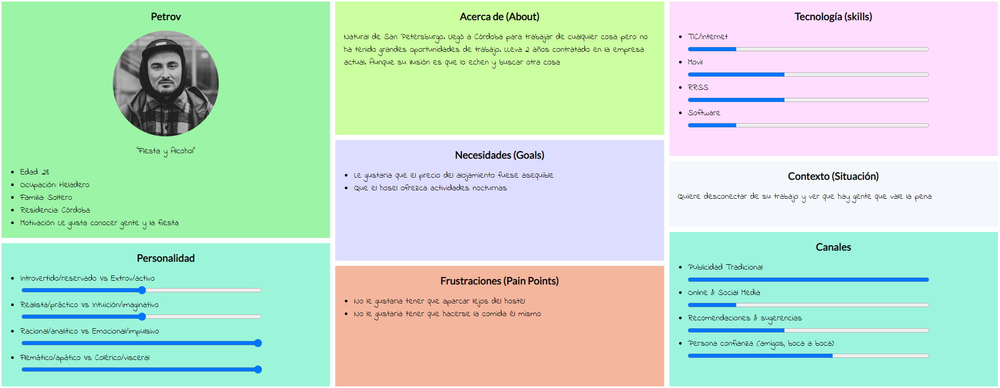
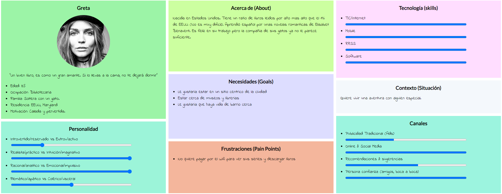
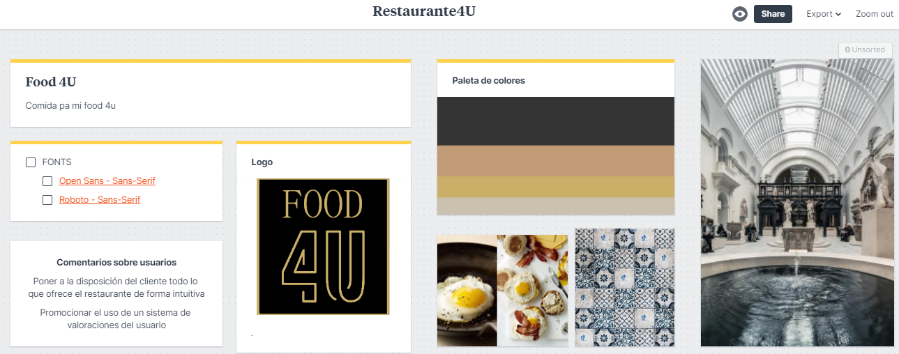
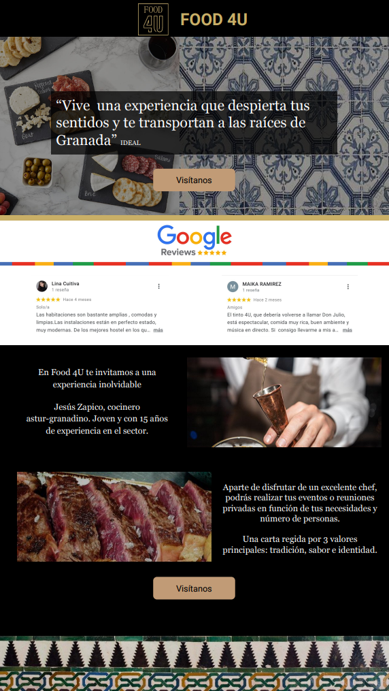

# DIU22
Prácticas Diseño Interfaces de Usuario 2021-22 (Tema: Hostels) 

Grupo: DIU3_08JavierNuñezMiguelMedina.  Curso: 2021/22 
Updated: 11/2/2022

Proyecto: 
>>> Hostel 4U

Descripción: 

>>> Crear un microsite para facilitar el acceso a toda la información del restaurante. Proporcionando el menú y ofertas exclusivas para la gente del hostal. También debería permitir la reserva.

Logotipo: 
>>> 

Miembros
 * :bust_in_silhouette:   Javier Nuñez Suarez     :octocat: @Javinunezs
 * :bust_in_silhouette:  Miguel Medina Martínez     :octocat: @miguemedina11

----- 

# Proceso de Diseño 

## Paso 1. UX Desk Research & Analisis 

 1.a Competitive Analysis
-----

Nuestro hostel se centra mas en ofrecer servicios de hotel como restaurante y bar de copas con actuaciones. Aun así ofrece lavanderia, wifi gratis y excursiones. Lo que lo hace un buen hostel a pesar de contar con taquillas de pago y no ofrecer recepción las 24 horas del dia.

 1.b Persona
-----

Hemos elegido dos personas que a pesar de ser ambas solteras, buscan una experiencia completamente diferente en nuestro hostel. Uno salir de fiesta y la otra una visita cultural. Aun así sus motivaciones tienen en comun el aspecto social que ofrecen los hostels.

 1.c User Journey Map
----

Estás dos experiencias de usuario las hemos elegido en base al carácter de cada persona, adaptándose por ejemplo la estancia y la manera de acceder a la información según cada persona.

 1.d Usability Review
----
>>>  Revisión de usabilidad:
>>> - Enlace al documento:  [Usability Review](P1/Usability-review-template.xlsx)
>>> - Valoración final (numérica): 83
>>> - Comentario sobre la valoración: En general la pagina cumple bien con los objetivos y permite reservar y saber mas del establecimiento. Aun asi cuenta con algunos errores en cuanto al uso de colores de la tipografia. Tampoco permite distinguir donde te encuentras en la pagina. Cabe destacar que el proceso de reserva es muy intuitivo e incluso te corrige algunos errores mientras que rellenas los campos. 

## Paso 2. UX Design  

 2.a Feedback Capture Grid / EMpathy map / POV
----

 2.b ScopeCanvas

----
Propuesta de valor:
Crear un microsite para facilitar el acceso a toda la información del restaurante. Proporcionando el menú y ofertas exclusivas para la gente del hostal. También debería permitir la reserva.

 2.b Tasks analysis 
-----

 2.c IA: Sitemap + Labelling 
----

> Restaurante: Descubre lo que ofrece nuestro restaurante y reserva de forma sencilla.

> Menú: Información detallada de los platos y precios que ofrece nuestro restaurante además de fotos de algunos de éstos.

> Ofertas: Información detallada y precios de las ofertas disponibles para los clientes del hostel. 

> Contacto: Formulario a rellenar para contactar por email. Información de la localización y del contacto telefónico.

 2.d Wireframes
-----

## Paso 3. Mi UX-Case Study (diseño)

 3.a Moodboard
-----

  3.b Landing Page
----

 3.c Guidelines
----

Tras consultar la página web https://ui-patterns.com/ hemos recolectado unos patrones que nos pueden ser útiles en el desarrollo de nuestra página:

- [Home link](https://ui-patterns.com/patterns/HomeLink): Para facilitar la vuelta a la página principal presionando el logo

- [Navigation tabs](https://ui-patterns.com/patterns/NavigationTabs): Para llevar a cabo la navegación entre nuestro sitio con varias páginas.

- [Carousel](https://ui-patterns.com/patterns/Carousel): Para mostrar imágenes relevantes

- [Input prompt](https://ui-patterns.com/patterns/InputPrompt): Para pedir información relevante al usuario para contactar con nosotros o hacer su reserva

- [Testimonials](https://ui-patterns.com/patterns/testimonials): Para que los usuarios puedan ver las reseñas que otros usuarios han dejado sobre nuestro establecimiento.

  3.d Mockup
----

 A partir de los bocetos realizados previamente, hemos desarrollado un prototipo usando Protopie que puede ser accedido a través de este link:

https://cloud.protopie.io/p/dceb60d53b

 3.e ¿My UX-Case Study?
-----

>>> Publicar my Case Study en Github..
>>> Documente y resuma el diseño de su producto en forma de video de 90 segundos aprox

## Paso 4. Evaluación 

 4.a Caso asignado
----

>>> Breve descripción del caso asignado con enlace a  su repositorio Github

 4.b User Testing
----

>>> Seleccione 4 personas ficticias. Exprese las ideas de posibles situaciones conflictivas de esa persona en las propuestas evaluadas. Asigne dos a Caso A y 2 al caso B
 

| Usuarios | Sexo/Edad     | Ocupación   |  Exp.TIC    | Personalidad | Plataforma | TestA/B
| ------------- | -------- | ----------- | ----------- | -----------  | ---------- | ----
| User1's name  | H / 18   | Estudiante  | Media       | Introvertido | Web.       | A 
| User2's name  | H / 18   | Estudiante  | Media       | Timido       | Web        | A 
| User3's name  | M / 35   | Abogado     | Baja        | Emocional    | móvil      | B 
| User4's name  | H / 18   | Estudiante  | Media       | Racional     | Web        | B 

. 4.c Cuestionario SUS
----

>>> Usaremos el **Cuestionario SUS** para valorar la satisfacción de cada usuario con el diseño (A/B) realizado. Para ello usamos la [hoja de cálculo](https://github.com/mgea/DIU19/blob/master/Cuestionario%20SUS%20DIU.xlsx) para calcular resultados sigiendo las pautas para usar la escala SUS e interpretar los resultados
http://usabilitygeek.com/how-to-use-the-system-usability-scale-sus-to-evaluate-the-usability-of-your-website/)
Para más información, consultar aquí sobre la [metodología SUS](https://cui.unige.ch/isi/icle-wiki/_media/ipm:test-suschapt.pdf)

>>> Adjuntar captura de imagen con los resultados + Valoración personal 

 4.d Usability Report
----

>> Añadir report de usabilidad para práctica B (la de los compañeros)

>>> Valoración personal 

>>> ## Paso 5. Evaluación de Accesibilidad  (no necesaria)

>>>   5.a Accesibility evaluation Report 
>>>> ----

>>> Indica qué pretendes evaluar (de accesibilidad) sobre qué APP y qué resultados has obtenido 

>>> 5.a) Evaluación de la Accesibilidad (con simuladores o verificación de WACG) 
>>> 5.b) Uso de simuladores de accesibilidad 

>>> (uso de tabla de datos, indicar herramientas usadas) 

>>> 5.c Breve resumen del estudio de accesibilidad (de práctica 1) y puntos fuertes y de mejora de los criterios de accesibilidad de tu diseño propuesto en Práctica 4.

## Conclusión final / Valoración de las prácticas

>>> (90-150 palabras) Opinión del proceso de desarrollo de diseño siguiendo metodología UX y valoración (positiva /negativa) de los resultados obtenidos  

